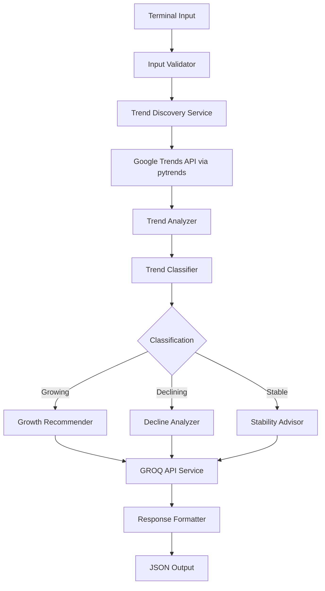

# Design Document: Brand Trend Revenue Intelligence Agent

## Overview

The Brand Trend Revenue Intelligence Agent is a Python-based terminal application that analyzes brand trends using Google Trends data and provides actionable revenue recommendations. The system integrates with the GROQ API for intelligent analysis and returns structured JSON responses containing trend classifications, growth recommendations, or pivot strategies.

The application follows a pipeline architecture: input collection → trend discovery → trend analysis → classification → recommendation generation → structured output. The system uses the pytrends library for Google Trends data retrieval and the GROQ API for natural language analysis and recommendation generation.

## Architecture

The system follows a modular pipeline architecture with clear separation of concerns:



**Key Architectural Decisions:**

1. **Pipeline Architecture**: Each stage processes data and passes it to the next, enabling clear testing boundaries and easy extension
2. **Service Layer Pattern**: External APIs (Google Trends, GROQ) are wrapped in service classes for testability and error handling
3. **Strategy Pattern**: Different recommendation strategies (growth, decline, stable) are implemented as separate components selected by the classifier
4. **Single Responsibility**: Each module handles one aspect (discovery, classification, recommendation, formatting)

## Components and Interfaces

### 1. Input Validator

**Responsibility**: Validate and sanitize user input from terminal

**Interface**:
```python
class InputValidator:
    def validate_domain(domain: str) -> ValidationResult
    def prompt_for_domain() -> str
```

**Key Behaviors**:
- Validates domain is non-empty string
- Strips whitespace and normalizes input
- Returns clear error messages for invalid input

### 2. Trend Discovery Service

**Responsibility**: Retrieve trending topics for a given domain using Google Trends

**Interface**:
```python
class TrendDiscoveryService:
    def __init__(pytrends_client: TrendReq)
    def discover_trends(domain: str, limit: int = 3) -> List[TrendData]
    def get_trend_interest_over_time(keyword: str, timeframe: str) -> DataFrame
```

**Key Behaviors**:
- Uses pytrends library to query Google Trends
- Retrieves related queries and trending searches for domain
- Fetches historical interest data for trend analysis
- Returns at least 3 relevant trends when available
- Handles API rate limits and connection errors

**Implementation Notes**:
- Uses `TrendReq()` from pytrends.request for API connection
- Leverages `interest_over_time()` method for historical data
- Uses `related_queries()` for discovering domain-related trends

### 3. Trend Analyzer

**Responsibility**: Calculate growth metrics from trend data

**Interface**:
```python
class TrendAnalyzer:
    def calculate_growth_slope(interest_data: DataFrame) -> float
    def analyze_trend_momentum(trend_data: TrendData) -> TrendMetrics
```

**Key Behaviors**:
- Calculates growth slope using linear regression on interest values
- Computes percentage change over time window
- Identifies peak interest and current interest levels
- Returns quantified metrics for classification

**Algorithm**:
- Uses last 90 days of interest data
- Applies linear regression to calculate slope
- Normalizes slope to percentage growth rate
- Formula: `growth_rate = (slope / mean_interest) * 100`

### 4. Trend Classifier

**Responsibility**: Classify trends as growing, stable, or declining

**Interface**:
```python
class TrendClassifier:
    def classify(trend_metrics: TrendMetrics) -> TrendClassification
```

**Key Behaviors**:
- Classifies based on growth slope thresholds
- Growing: slope > +5% per month
- Stable: slope between -5% and +5% per month
- Declining: slope < -5% per month
- Returns classification with confidence score

### 5. Growth Recommender

**Responsibility**: Generate actionable recommendations for growing trends

**Interface**:
```python
class GrowthRecommender:
    def __init__(groq_client: Groq)
    def generate_recommendations(
        trend_data: TrendData,
        trend_metrics: TrendMetrics,
        domain: str
    ) -> GrowthRecommendations
```

**Key Behaviors**:
- Generates exactly 3 concrete growth actions
- Provides domain-specific content angles
- Suggests budget scaling strategy (e.g., "increase by 20-30%")
- Explains reach/conversion impact for each action
- Quantifies expected business impact

**GROQ Integration**:
- Uses structured prompts to ensure consistent output format
- Requests JSON-formatted responses from GROQ
- Includes trend metrics in prompt for data-driven recommendations
- Uses temperature=0.7 for balanced creativity and consistency

### 6. Decline Analyzer

**Responsibility**: Analyze declining trends and recommend pivot strategies

**Interface**:
```python
class DeclineAnalyzer:
    def __init__(groq_client: Groq)
    def analyze_decline(
        trend_data: TrendData,
        trend_metrics: TrendMetrics,
        domain: str
    ) -> DeclineAnalysis
```

**Key Behaviors**:
- Estimates days until engagement collapse using decay rate
- Calculates projected marketing burn based on current spend trajectory
- Recommends EXIT or TRY REVIVAL based on decline severity
- Suggests 2-3 alternative rising trends in related domains
- Provides content strategy for pivot

**Decline Severity Calculation**:
- Severe decline (>20% drop/month): Recommend EXIT
- Moderate decline (10-20% drop/month): Recommend TRY REVIVAL with conditions
- Uses exponential decay model to estimate collapse timeline

### 7. GROQ API Service

**Responsibility**: Manage all interactions with GROQ API

**Interface**:
```python
class GroqService:
    def __init__(api_key: str)
    def generate_analysis(
        prompt: str,
        system_context: str,
        temperature: float = 0.7
    ) -> str
```

**Key Behaviors**:
- Authenticates using provided API key
- Handles rate limiting with exponential backoff
- Manages connection errors and timeouts
- Validates API responses
- Uses chat.completions.create() method

**Implementation Details**:
```python
from groq import Groq

client = Groq(api_key=os.environ.get("GROQ_API_KEY"))
response = client.chat.completions.create(
    model="llama3-70b-8192",
    messages=[
        {"role": "system", "content": system_context},
        {"role": "user", "content": prompt}
    ],
    temperature=0.7,
    max_tokens=2000
)
```

### 8. Response Formatter

**Responsibility**: Format all outputs as structured JSON

**Interface**:
```python
class ResponseFormatter:
    def format_response(
        classification: TrendClassification,
        recommendations: Union[GrowthRecommendations, DeclineAnalysis],
        trend_data: TrendData
    ) -> str
```

**Key Behaviors**:
- Validates all data before formatting
- Ensures valid JSON structure
- Includes all required fields per classification type
- Pretty-prints JSON for readability
- Handles serialization of custom objects

## Data Models

### TrendData
```python
@dataclass
class TrendData:
    keyword: str
    domain: str
    interest_over_time: DataFrame
    current_interest: int
    peak_interest: int
    related_queries: List[str]
```

### TrendMetrics
```python
@dataclass
class TrendMetrics:
    growth_slope: float  # Percentage per month
    current_interest: int  # 0-100 scale
    peak_interest: int
    average_interest: float
    volatility: float
    trend_direction: str  # "up", "down", "flat"
```

### TrendClassification
```python
@dataclass
class TrendClassification:
    category: str  # "growing", "stable", "declining"
    confidence: float  # 0.0 to 1.0
    growth_rate: float  # Percentage
    reasoning: str
```

### GrowthRecommendations
```python
@dataclass
class GrowthRecommendations:
    actions: List[GrowthAction]  # Exactly 3 actions
    content_angles: List[str]
    budget_strategy: BudgetStrategy
    estimated_impact: ImpactMetrics
```

### GrowthAction
```python
@dataclass
class GrowthAction:
    title: str
    description: str
    expected_reach_increase: str  # e.g., "15-25%"
    expected_conversion_impact: str  # e.g., "10-15% lift"
    implementation_priority: str  # "high", "medium", "low"
```

### DeclineAnalysis
```python
@dataclass
class DeclineAnalysis:
    days_until_collapse: int
    projected_marketing_burn: float
    recommendation: str  # "EXIT" or "TRY REVIVAL"
    revival_conditions: Optional[List[str]]
    alternative_trends: List[AlternativeTrend]  # 2-3 alternatives
    pivot_strategy: PivotStrategy
```

### AlternativeTrend
```python
@dataclass
class AlternativeTrend:
    keyword: str
    growth_rate: float
    relevance_to_domain: str
    entry_difficulty: str  # "low", "medium", "high"
```

### OutputSchema
```python
{
    "analysis_timestamp": "ISO 8601 datetime",
    "domain": "string",
    "trend_classification": {
        "category": "growing|stable|declining",
        "confidence": "float",
        "growth_rate": "float",
        "reasoning": "string"
    },
    "recommendations": {
        # Structure varies by classification
        # See GrowthRecommendations or DeclineAnalysis
    },
    "trend_data": {
        "keyword": "string",
        "current_interest": "int",
        "peak_interest": "int",
        "metrics": "TrendMetrics object"
    }
}
```


## Correctness Properties

*A property is a characteristic or behavior that should hold true across all valid executions of a system—essentially, a formal statement about what the system should do. Properties serve as the bridge between human-readable specifications and machine-verifiable correctness guarantees.*

### Property 1: Trend Discovery Returns Sufficient Results

*For any* valid brand domain where trends exist, the trend discovery service should return at least 3 relevant trending topics related to that domain.

**Validates: Requirements 1.1, 1.3**

### Property 2: Classification Correctness

*For any* trend with calculated growth slope, the classification should be exactly one of {growing, stable, declining}, where:
- Positive slope (>5%/month) → growing
- Near-zero slope (-5% to +5%/month) → stable  
- Negative slope (<-5%/month) → declining

**Validates: Requirements 2.1, 2.2, 2.3, 2.4**

### Property 3: Growth Slope Determinism

*For any* set of historical interest values, calculating the growth slope multiple times should produce the same result (deterministic calculation).

**Validates: Requirements 2.5**

### Property 4: Complete Growth Recommendations

*For any* trend classified as growing, the recommendations should contain:
- Exactly 3 concrete growth actions
- A budget scaling strategy
- Quantified impact metrics (reach/conversion) for each action
- Content angles mentioning the brand domain

**Validates: Requirements 3.1, 3.2, 3.3, 3.4, 3.5**

### Property 5: Complete Decline Analysis

*For any* trend classified as declining, the analysis should contain:
- A numeric estimate of days until collapse
- A numeric projected marketing burn value
- A recommendation of exactly "EXIT" or "TRY REVIVAL"
- Between 2 and 3 alternative rising trends
- A non-empty pivot strategy

**Validates: Requirements 4.1, 4.2, 4.3, 4.4, 4.5**

### Property 6: Valid and Complete JSON Output

*For any* analysis result, the output should:
- Be valid parseable JSON
- Contain a trend_classification field with category, confidence, and growth_rate
- Contain a recommendations field with appropriate structure for the classification
- Contain quantified business impact metrics with numeric values

**Validates: Requirements 6.1, 6.2, 6.3, 6.4, 6.5**

### Property 7: Input Validation Rejects Empty Domains

*For any* string composed entirely of whitespace or empty string, the input validator should reject it and return a validation error.

**Validates: Requirements 7.2**

### Property 8: Data Integrity in Recommendations

*For any* generated recommendation, all quantified metrics in the output should be derived from or consistent with the input trend metrics, not invented or hallucinated.

**Validates: Requirements 8.1, 8.2, 8.4**

### Property 9: Reasoning References Actual Metrics

*For any* analysis with reasoning text, the reasoning should contain references to specific numeric values from the trend metrics (not generic statements).

**Validates: Requirements 8.3**

### Property 10: Uncertainty Indication for Sparse Data

*For any* trend with insufficient historical data (less than 30 days of interest values), the system should include explicit uncertainty indicators in the output.

**Validates: Requirements 8.5**

## Error Handling

The system must handle errors gracefully at multiple levels:

### Input Validation Errors
- **Empty domain**: Return clear error message "Domain cannot be empty"
- **Invalid characters**: Sanitize input, remove special characters
- **Null input**: Prompt user again with error message

### External API Errors

**Google Trends (pytrends)**:
- **Rate limiting**: Implement exponential backoff (1s, 2s, 4s, 8s delays)
- **Connection timeout**: Retry up to 3 times, then return error
- **No data available**: Return structured error indicating no trends found
- **Invalid domain**: Return error suggesting domain reformulation

**GROQ API**:
- **Authentication failure**: Return error "Invalid GROQ API key"
- **Rate limiting**: Implement exponential backoff, inform user of delay
- **Service unavailable**: Return error "GROQ service temporarily unavailable"
- **Timeout**: Retry once, then return error with partial results if available
- **Invalid response**: Log error, attempt to parse partial response, or return error

### Data Processing Errors
- **Insufficient trend data**: Return error indicating minimum data requirements
- **Calculation errors**: Log error details, return error to user
- **Classification ambiguity**: Default to "stable" with low confidence score

### JSON Formatting Errors
- **Serialization failure**: Log error, attempt simplified output format
- **Validation failure**: Log validation errors, fix structure, retry once

### Error Response Format
All errors should be returned as structured JSON:
```json
{
    "status": "error",
    "error_type": "string",
    "message": "string",
    "timestamp": "ISO 8601 datetime",
    "retry_possible": boolean
}
```

## Testing Strategy

The system will use a dual testing approach combining unit tests for specific examples and property-based tests for universal correctness guarantees.

### Property-Based Testing

**Framework**: Hypothesis (Python property-based testing library)

**Configuration**:
- Minimum 100 iterations per property test
- Each test tagged with format: **Feature: brand-trend-intelligence, Property {N}: {property_text}**

**Property Test Coverage**:

1. **Property 1 Test**: Generate random valid domains, mock trend discovery to return varying numbers of trends, verify count >= 3
   - Generator: arbitrary domain strings (alphanumeric + common categories)
   - Assertion: len(results) >= 3 when trends exist

2. **Property 2 Test**: Generate random growth slopes, verify classification matches expected category
   - Generator: float values from -50% to +50%
   - Assertion: classification category matches slope threshold rules

3. **Property 3 Test**: Generate random interest time series, calculate slope twice, verify identical results
   - Generator: lists of integers 0-100 representing interest over time
   - Assertion: slope_1 == slope_2

4. **Property 4 Test**: Generate random growing trend data, verify recommendation completeness
   - Generator: trend data with positive slope
   - Assertions: len(actions) == 3, budget_strategy exists, all actions have impact metrics, domain mentioned in content

5. **Property 5 Test**: Generate random declining trend data, verify analysis completeness
   - Generator: trend data with negative slope
   - Assertions: days_until_collapse is numeric, marketing_burn is numeric, recommendation in {"EXIT", "TRY REVIVAL"}, 2 <= len(alternatives) <= 3, pivot_strategy non-empty

6. **Property 6 Test**: Generate random analysis results, verify JSON validity and completeness
   - Generator: various classification types with recommendations
   - Assertions: json.loads() succeeds, required fields present, metrics are numeric

7. **Property 7 Test**: Generate random whitespace/empty strings, verify rejection
   - Generator: strings with only spaces, tabs, newlines, or empty
   - Assertion: validation returns error

8. **Property 8 Test**: Generate random trend metrics and recommendations, verify output metrics are within reasonable bounds of input
   - Generator: trend metrics with known ranges
   - Assertion: output metrics don't exceed input by unrealistic factors (e.g., >10x)

9. **Property 9 Test**: Generate random analysis results, verify reasoning contains numeric references
   - Generator: various trend data and classifications
   - Assertion: reasoning text contains at least one number matching input metrics

10. **Property 10 Test**: Generate sparse trend data (<30 days), verify uncertainty indicators present
    - Generator: short time series (5-29 days)
    - Assertion: output contains uncertainty keywords ("estimated", "limited data", "uncertain")

### Unit Testing

Unit tests complement property tests by verifying specific examples, edge cases, and integration points:

**Input Validation Tests**:
- Test specific valid domains ("clothing", "technology", "food")
- Test edge cases (single character, very long strings, unicode)
- Test special characters handling

**Trend Discovery Tests**:
- Test with mocked pytrends responses
- Test error handling for API failures
- Test rate limiting behavior

**Classification Tests**:
- Test boundary values (exactly 5%, exactly -5%)
- Test extreme values (100% growth, -100% decline)
- Test zero slope

**GROQ Integration Tests**:
- Test with mocked GROQ responses
- Test error handling for various failure modes
- Test response parsing

**JSON Formatting Tests**:
- Test serialization of all data model types
- Test handling of special characters in text fields
- Test large response handling

**End-to-End Tests**:
- Test complete pipeline with mocked external services
- Test error propagation through pipeline
- Test output format for each classification type

### Test Organization

```
tests/
├── unit/
│   ├── test_input_validator.py
│   ├── test_trend_discovery.py
│   ├── test_trend_analyzer.py
│   ├── test_classifier.py
│   ├── test_recommenders.py
│   ├── test_groq_service.py
│   └── test_response_formatter.py
├── property/
│   ├── test_properties_discovery.py
│   ├── test_properties_classification.py
│   ├── test_properties_recommendations.py
│   ├── test_properties_output.py
│   └── test_properties_data_integrity.py
└── integration/
    ├── test_pipeline.py
    └── test_error_handling.py
```

### Testing Best Practices

- Mock external APIs (pytrends, GROQ) in unit and property tests
- Use real API calls only in manual integration tests (not automated)
- Property tests should focus on structural correctness and data integrity
- Unit tests should focus on specific business logic and edge cases
- All tests should be deterministic (no flaky tests)
- Use fixtures for common test data (sample trend data, mock responses)
